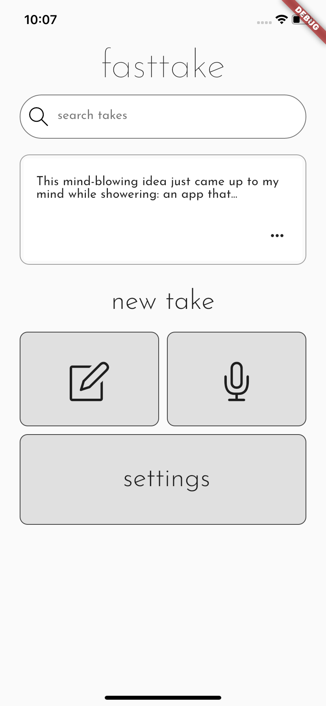
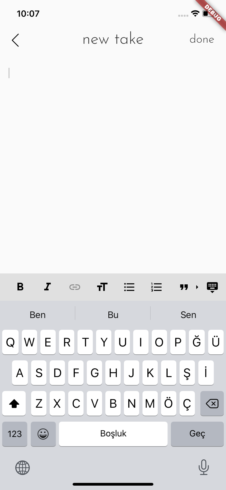
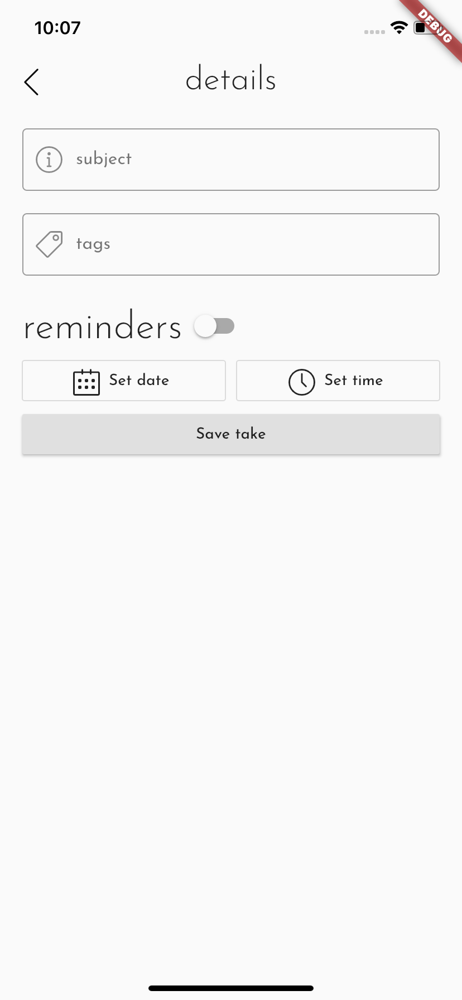
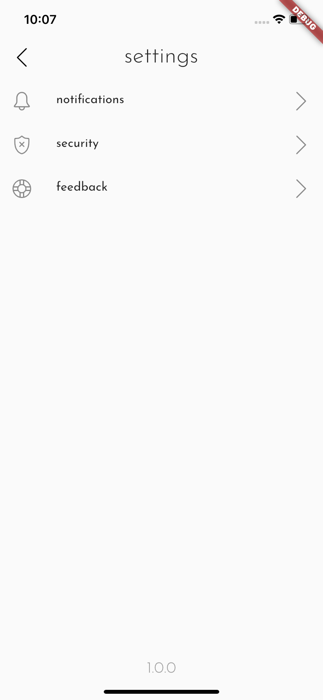

An app to take notes of those that come up on your mind, without having to wait. Written in Dart using Flutter.

<!-- ALL-CONTRIBUTORS-BADGE:START - Do not remove or modify this section -->

<!-- ALL-CONTRIBUTORS-BADGE:END -->

### Current status

 Home | Take Editor | Take Details | Settings |
 |:-:|:-:|:-:|:-:|
 |  |  |  |  |
 
Important: Screenshots above are updated mostly every day and may subject to change when you build the app on your computer. Major and minor changes are done every day and every hour.

## Features
The main idea and the function of the app is to document the ideas (and things) that come up on your mind instantly without forgetting them.

- Quickly save ideas that come up on your mind with only one tap.
- 

## How to build and contribute

### 1. Install Flutter
Prepare your development environment from this official installation guide from the Flutter team.

### 2. Clone the repository
Clone the fasttake repository.

`git clone https://github.com/ardacebi/fasttake`

### 3. Preview app and start development
Using your favorite IDE, you can start previewing the current status of the app by launching the app on an emulator or your physical device and start making your edits.

All contributions are welcome. You can follow the to-do's from the issues area or propose your own suggestions and changes via a pull request.

Thank you for your contributions!

## Contributors ✨

Thanks goes to these wonderful people ([emoji key](https://allcontributors.org/docs/en/emoji-key)):

<!-- ALL-CONTRIBUTORS-LIST:START - Do not remove or modify this section -->
<!-- prettier-ignore-start -->
<!-- markdownlint-disable -->
<table>
  <tr>
    <td align="center"><a href="https://www.ardacebi.com"> <b>Arda Çebi</b></a> <a href="https://github.com/ardacebi/fasttake/commits?author=ardacebi" title="Code">💻</a> <a href="#ideas-ardacebi" title="Ideas, Planning, & Feedback">🤔</a> <a href="#design-ardacebi" title="Design">🎨</a> <a href="#translation-ardacebi" title="Translation">🌍</a></td>
    <td align="center"><a href="http://baranonen.com"> <b>Baran Önen</b></a> <a href="#ideas-baranonen" title="Ideas, Planning, & Feedback">🤔</a> <a href="#design-baranonen" title="Design">🎨</a></td>
  </tr>
</table>

<!-- markdownlint-enable -->
<!-- prettier-ignore-end -->
<!-- ALL-CONTRIBUTORS-LIST:END -->

This project follows the [all-contributors](https://github.com/all-contributors/all-contributors) specification. Contributions of any kind welcome!
